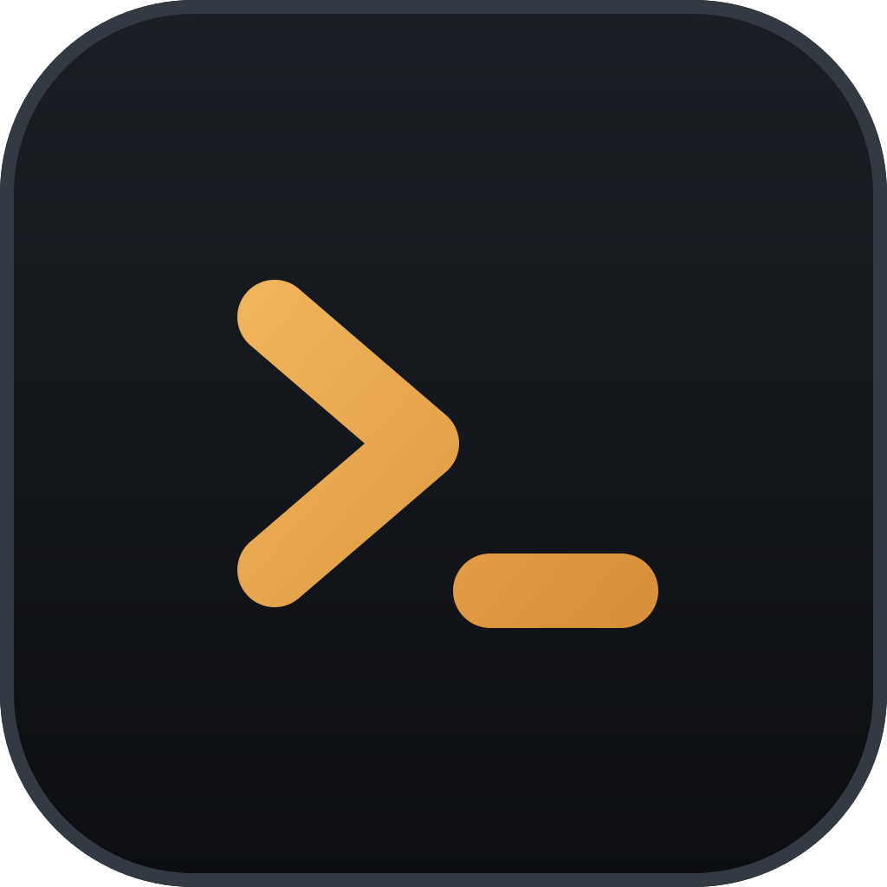
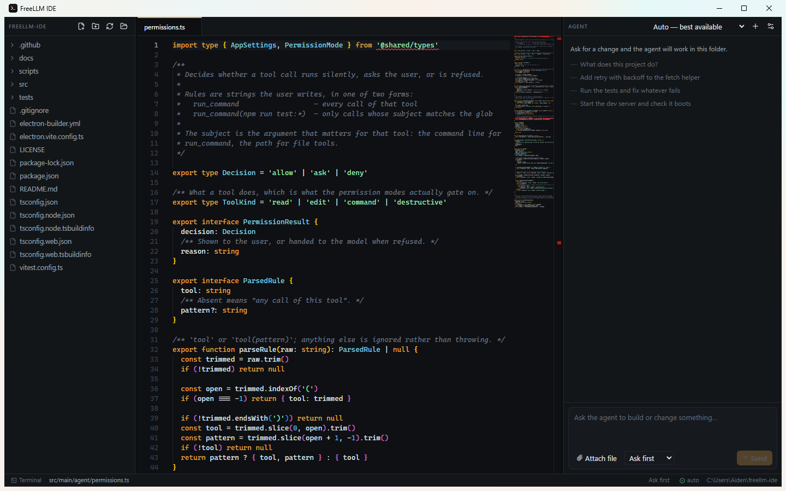

<div align="center">
  
  <h1>FreeLLM IDE</h1>
  <p><strong>A desktop code editor with a coding agent built in — pointed at whatever LLM endpoint you already have.</strong></p>
  <p>Your key, your models, your machine. No account, no per-token bill, no vendor lock-in.</p>
  <p>
    
    
    
  </p>
</div>



File tree, Monaco editor, integrated terminal, and an agent that reads, edits,
runs commands and starts servers in your project while you watch every step.

Works with **any OpenAI-compatible endpoint**: a
[FreeLLMAPI](https://github.com/tashfeenahmed/freellmapi) gateway, OpenRouter,
Together, Groq, a local Ollama or LM Studio, or OpenAI itself. Paste a base URL
and a key.

> ### 🔑 Bring your own API key
>
> **No key ships with this app.** Nothing is bundled, hardcoded, or phoned home.
> On first launch you enter your own endpoint and your own key, and it is stored
> **locally on your machine only** — encrypted with your OS keychain (DPAPI on
> Windows, Keychain on macOS, libsecret on Linux).
>
> The key never leaves your computer except to reach the endpoint *you* named,
> never reaches the app's renderer process, and is never written into the repo
> or any log.
>
> **Don't have a key yet?** You can get one from [freellmapi.co](https://freellmapi.co/),
> which is what I use — it hands you a single key that routes across a lot of
> free and paid models. Any OpenAI-compatible provider works just as well; use
> whatever you prefer.
>
> *I am not sponsored by, affiliated with, or working with FreeLLMAPI in any
> way. It's just what I happen to use, and this app is not endorsed by them.*

## Install

```bash
git clone https://github.com/ucmyg/freellm-ide.git
cd freellm-ide
npm install
npm run dev
```

Or grab a build from [Releases](../../releases).

## Connect it

Open **Settings** (gear in the Agent panel, or `Ctrl+,`):

| Endpoint | Base URL |
|---|---|
| FreeLLMAPI | `http://localhost:3001` |
| OpenRouter | `https://openrouter.ai/api` |
| OpenAI | `https://api.openai.com` |
| Ollama | `http://localhost:11434` |
| LM Studio | `http://localhost:1234` |

Where to get a key:

| Endpoint | Where the key comes from |
|---|---|
| FreeLLMAPI | [freellmapi.co](https://freellmapi.co/), or your own gateway's **Keys** page (starts with `freellmapi-`) |
| OpenRouter | [openrouter.ai/keys](https://openrouter.ai/keys) |
| OpenAI | [platform.openai.com/api-keys](https://platform.openai.com/api-keys) |
| Ollama / LM Studio | Runs locally — any non-empty string works |

Paste your key, hit **Save & test connection**, and pick a model. **The model
must support tool calling** — the agent works entirely through tools, so a model
without them can only talk.

Your key is stored via Electron's `safeStorage`, encrypted with your OS keychain,
and never reaches the renderer process — only a "a key is set" flag does. It
lives in your user data directory, not in the project:

| | |
|---|---|
| Windows | `%APPDATA%\freellm-ide\` |
| macOS | `~/Library/Application Support/freellm-ide/` |
| Linux | `~/.config/freellm-ide/` |

Delete that folder, or hit **Clear** in Settings, to remove it entirely.

## What the agent can do

| Tool | |
|---|---|
| `read_file` `list_files` `find_files` `search_files` | Explore the project |
| `edit_file` `write_file` `delete_file` | Change it |
| `run_command` | Builds, tests, linters, git |
| `start_background` `read_background` `stop_background` `list_background` | Dev servers, watchers, log tails |
| `system_info` | Platform, shell, and what it is allowed to reach |

Long-running processes are the part most agent UIs get wrong: `run_command`
blocks and times out, so a dev server is started with `start_background`
instead, polled with `read_background`, and killed with `stop_background`.
Anything still running shows in the status bar with a stop button, and
everything is killed when the app quits.

## Permissions

Four modes, switchable from the composer or the status bar:

| Mode | Behaviour |
|---|---|
| **Read only** | Inspect only. Every write and command is refused. |
| **Ask first** (default) | Reads run freely; edits and commands ask. |
| **Auto edit** | File edits apply silently; commands still ask. |
| **Full access** | Nothing asks. Deny rules still apply. |

Approval prompts show the concrete effect — a unified diff for an edit, the
exact command line for a shell call — not just a tool name. Destructive commands
(`rm -rf`, `git push`, piping curl to a shell) are flagged high-risk and never
offer "always allow".

### Rules

Two lists in Settings, one rule per line:

```
run_command(npm run test:*)   # allow one family of commands
edit_file(src/*.ts)           # allow edits under src
delete_file                   # every call of the tool
```

**Deny rules beat everything**, including Full access. Allow rules turn an "ask"
into an "allow" but cannot unlock Read-only mode. Patterns are anchored globs, so
`npm run test:*` does not match `x && npm run test:unit`. Command rules are
case-sensitive so casing can never widen a grant.

Picking "always allow" on a prompt writes a rule for you — scoped to that exact
command line for `run_command`, rather than handing over the shell.

### Access

The agent is confined to the open folder; escapes are rejected before any
filesystem call. Settings → Access can add extra roots, or lift confinement
entirely with **full disk access** — at which point the agent can reach anything
your user account can. The status bar warns whenever that is on.

## Keys

| | |
|---|---|
| `Ctrl+S` | Save the active file |
| ``Ctrl+` `` | Toggle the terminal |
| `Ctrl+W` | Close the active tab |
| `Ctrl+,` | Settings |
| `Enter` / `Shift+Enter` | Send to the agent / newline |

`freellm-ide <path>` opens a folder directly.

## Why the OpenAI protocol

The agent drives `POST /v1/chat/completions`. Against a FreeLLMAPI gateway that
matters: the OpenAI shape is the gateway's own internal type system — every
provider adapter returns it — so that path has zero translation hops, while its
Anthropic surface is a shim over the same router that silently drops
`stop_sequences`, `response_format` and `parallel_tool_calls`.

Two consequences worth knowing if you hack on this:

- The gateway buffers tool-call deltas and emits **one** complete, JSON-repaired
  `tool_calls` chunk followed by a terminal `finish_reason`. There are no
  incremental argument fragments to assemble. The client accumulates anyway, so
  a server that does stream fragments works too.
- Requests carry a stable `X-Session-Id`, which pins a conversation to one
  upstream model. Switching models mid-thread is what triggers a gateway's
  tool-dialect rescue path.

## Development

```bash
npm run dev        # hot-reloading app
npm run typecheck  # both tsconfigs
npm test           # unit + permission suites
npm run build      # production bundles into out/
npm run dist       # installer into release/
npm run icons      # re-render build/icon.svg to png + ico
```

`tests/unit.test.ts` covers path confinement, ignore rules, globbing, search and
diffs. `tests/permissions.test.ts` covers the mode matrix and rule engine.
`tests/processes.test.ts` covers the background process manager.
`tests/agent-live.test.ts` drives the real agent loop against a real endpoint
and real models — it no-ops unless you opt in:

```bash
FREELLMAPI_API_KEY=sk-... FREELLMAPI_URL=http://localhost:3001 npm test
```

### Layout

```
src/
  main/            Electron main — owns the filesystem, shell and network
    agent/         system prompt, turn loop, tools, permissions, processes
    gateway/       OpenAI-compatible client (models, streaming chat)
    workspace/     path confinement, listing, search
    terminal/      PTY (prebuilt, no compiler needed) with a piped fallback
  preload/         the single contextBridge surface
  renderer/        React + Monaco + xterm UI
  shared/          types and IPC channel names used by all three
```

All network calls happen in **main**, never the renderer. That is deliberate: a
FreeLLMAPI gateway's CORS allowlist only admits its own dashboard origins, so a
renderer `fetch` would be blocked no matter how correct the key is. Requests
with no `Origin` header — any non-browser caller — are allowed.

## Contributing

Issues and PRs welcome. `npm run typecheck && npm test` should pass before you
open one; CI runs both on Linux and Windows.

## Author

**Aiden McGraw** — <aidenmcgraw55@gmail.com>

Built as an open alternative to subscription coding agents: the same workflow,
running on whatever endpoint you already pay for (or host yourself).

**Disclaimer:** FreeLLMAPI, OpenRouter, OpenAI, Ollama and every other provider
named here are independent projects. I am not sponsored by, affiliated with, or
working with any of them, and this app is not endorsed by any of them. They are
listed only because they expose an OpenAI-compatible API that this editor can
talk to.

## License

MIT © Aiden McGraw — see [LICENSE](LICENSE).
